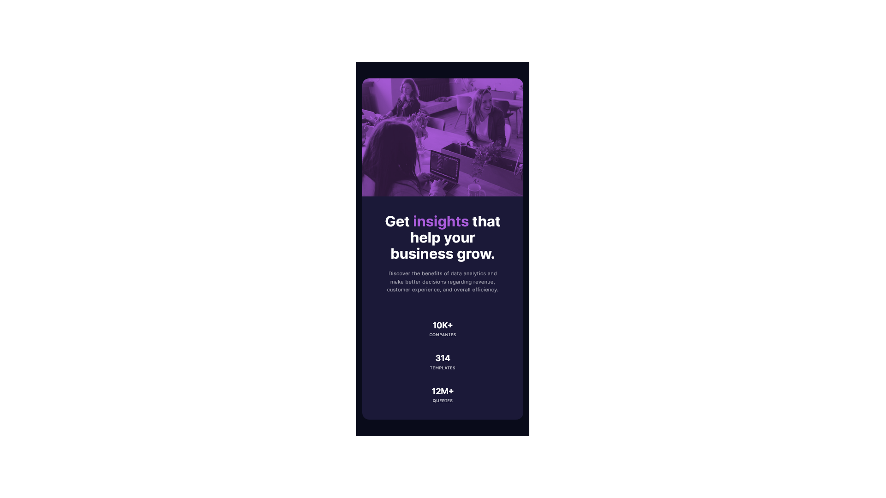

# Frontend Mentor - Stats preview card component solution

This is a solution to the [Stats preview card component challenge on Frontend Mentor](https://www.frontendmentor.io/challenges/stats-preview-card-component-8JqbgoU62). Frontend Mentor challenges help you improve your coding skills by building realistic projects.

 
 

# Table of contents

- [Overview](#overview)
  - [The challenge](#the-challenge)
  - [Screenshot](#screenshot)
  - [Links](#links)
- [My process](#my-process)
  - [Built with](#built-with)
  - [What I learned](#what-i-learned)
  - [Continued development](#continued-development)
  
- [Author](#author)

 
 

# Overview
 

## The challenge

Users should be able to:

- View the optimal layout depending on their device's screen size

 

## Screenshot

 

<h3 align='center'>Desktop Version</h3>

 
 

<h3 align='center'>Mobile Version</h3>

 
 

## Links

- Solution URL: [Frontend Mentor Solution](https://www.frontendmentor.io/solutions/stats-preview-card-flexbox-responsive-LjSOigunwI)
- Live Site URL: [Live Site at Vercel](https://stats-preview-card-component-main-b5x5caimu-murilopita.vercel.app/)

 
 

# My process

## Built with

- Semantic HTML5 markup
- CSS custom properties
- Flexbox
- Responsive Design

 

## What I learned

I learned the basics of 'Flexbox' and how to use it for a responsive webpage. Also I began my studies about 'Media Queries' and how to use them.

 

## Continued development

I'll keep practicing more about 'Media Queries, cause in this challenge I had some doubts and struggles with them in the process of this challenge. Please, be welcome to give me your feedback, tips or anything.

 

# Author

- GitHub - [murilopita](https://github.com/murilopita/Stats-preview-card-component-main)
- Frontend Mentor - [@murilopita](https://www.frontendmentor.io/profile/murilopita)

 

 It's have been a pleasure to be part of this community!
 